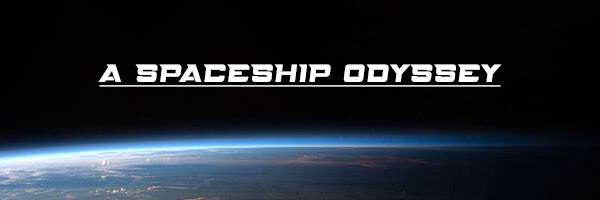
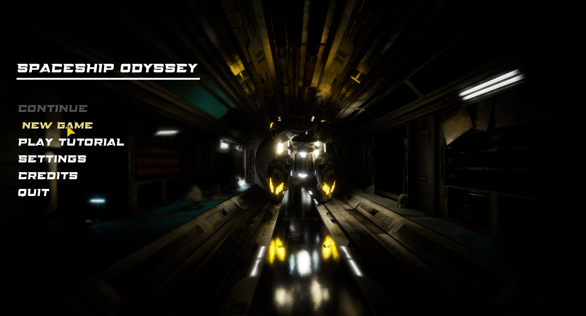
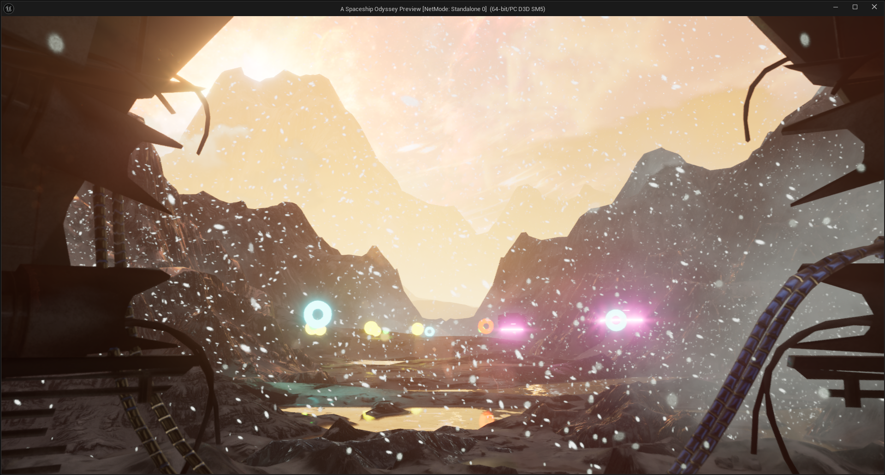
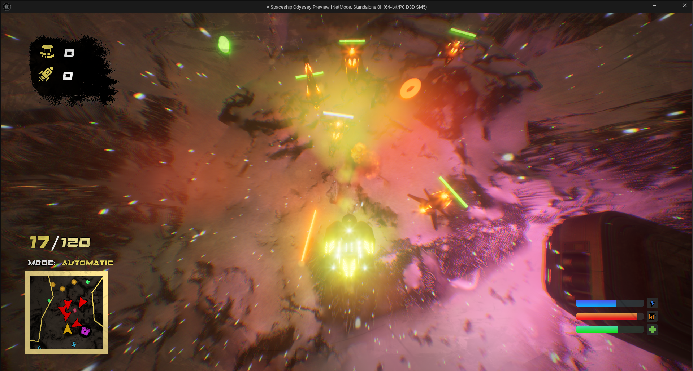
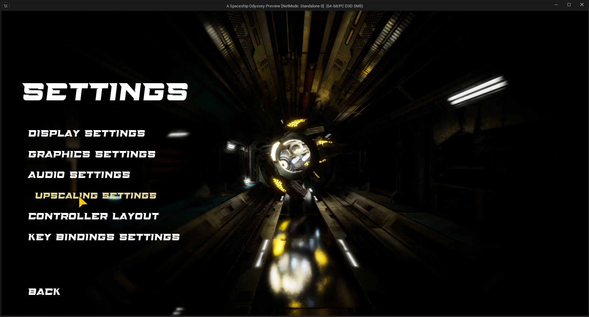

# A Spaceship Odyssey  

**A Spaceship Odyssey** is a thrilling 3D game built in Unreal Engine, where players take control of a spaceship to navigate through challenging levels, defeat intelligent enemies, and collect valuable pickups. The game features an engaging upgrade and skill tree system, a save/load functionality, and a dynamic fuel system to enhance gameplay.  

## Features  

- Fully moveable spaceship with smooth and precise controls.  
- Projectile shooting mechanism for engaging enemy spaceships.  
- Comprehensive HP and damage system to manage player health and combat mechanics.  
- A variety of collectible pickups, including Boosters, Beast Mode activators, Coins, Healing Items, and more.  
- A simple enemy AI system for dynamic combat scenarios.  
- Fully functional fuel system with interactive fuel stations.  
- Robust save/load game system to preserve progress seamlessly.  
- Three levels, including:  
  - A **Main Menu**  
  - A **Tutorial Level** for learning the game mechanics  
  - **Level 1** for the main gameplay experience  
- Fully implemented upgrade and skill tree system to enhance player progression.  
- Minimalistic yet feature-complete user interface (UI) with:  
  - Main Menu  
  - Pause Menu  
  - Settings Menu  
  - And more  
- Fully customizable resolution settings.  
- Adjustable brightness settings.  
- Window mode settings (Fullscreen, Windowed, Borderless).  
- V-Sync for smooth frame synchronization.  
- Comprehensive graphics settings, including:  
  - Preset graphics levels (Low, Medium, High, Ultra).  
  - Customizable graphics options for advanced users.  
  - Automatic hardware benchmarking for optimal default settings.  
- AMD FSR 3.1 upscaling with frame generation for improved performance and visuals.  
- Controller support (gameplay only).  
- Customizable keyboard key bindings for tailored controls.  
- And many more features and functionalities.  

## Optimizations  

To ensure the game runs smoothly and provides an enjoyable experience on a variety of hardware, the following optimizations were implemented:  

- **Baked Lighting**: Used baked lighting instead of dynamic lighting where possible to significantly reduce runtime performance overhead.  
- **Nanite System**: Integrated Unreal Engine's Nanite system for handling high-detail meshes efficiently, allowing for better performance without compromising visual quality.  
- **Level of Detail (LOD)**: Applied LODs to meshes, ensuring that less detailed versions of objects are rendered when viewed from a distance, thereby improving frame rates.  
- **AMD FSR 3.1**: Implemented AMD FidelityFX Super Resolution 3.1 with Frame Generation to provide better upscaling and smoother gameplay, especially on lower-end systems.  
- **Graphics Presets and Auto Settings**: Designed custom graphics presets and included an auto-detection feature that adjusts settings based on the user's hardware benchmark.  
- **Optimized Textures and Materials**: Reduced texture sizes and optimized materials to balance performance and quality.  

These optimizations ensure that the game maintains high visual fidelity while running efficiently on a wide range of hardware configurations.  

## System Requirements  

To run *A Spaceship Odyssey* smoothly, your system should meet the following minimum and recommended specifications:  

### Minimum Requirements:  
- **OS:** Windows 10 (64-bit)  
- **Processor:** Intel Core i3-1005G1 / AMD Ryzen 3 3250U 
- **Memory:** 6 GB RAM  
- **Graphics:** Nvidia GeForce GTX 950M / AMD Radeon R7 M440 with 2GB of VRAM
- **DirectX:** Version 11  
- **Storage:** 2 GB available space  

### Recommended Requirements:  
- **OS:** Windows 11 (64-bit)  
- **Processor:** Intel Core i7-8700 / AMD Ryzen 5 3600  
- **Memory:** 8 GB RAM  
- **Graphics:** NVIDIA GTX 750 / AMD RX 570 with 6 GB VRAM  
- **DirectX:** Version 12  
- **Storage:** 2 GB SSD available space  

### Additional Notes:  
- **Upscaling Technology:** AMD FSR 3.1 enabled for improved performance.  
- **Peripherals:** Controller support available (Gameplay only).  
- Ensure you have the latest GPU drivers installed for optimal performance.  
## Installation  

To install and play the game, follow these steps:  

1. Head to the **Releases** section of this repository and download the latest game build.  

2. Extract the downloaded file to your preferred location.  

3. Navigate to the following directory to ensure all prerequisites are installed:  
    \GameMainDirectory\Windows\Engine\Extras\Redist\en-us
    Run the file `UEPrereqSetup_x64.exe` to install Unreal Engine prerequisites.  

4. Once the prerequisites are installed, navigate to the following folder to start the game:
    \Windows
    Run `Project_Space_war.exe` to launch the game.  

Enjoy your space adventure! 🚀  

## Feedback  

I'd love to hear your thoughts about *A Spaceship Odyssey*!  

If you have any feedback, questions, or suggestions, feel free to reach out to me through:  
- **Telegram**: [@mh_tirdad](https://telegram.org/mh_tirdad)  
- **Email**: mohamma.moa1381@gmail.com  

Your feedback is invaluable in helping me improve the game!  

## Credits

I would like to express my gratitude to the following individuals for their valuable feedback, suggestions, and support throughout the development of *A Spaceship Odyssey*:  

- [@selmashez](https://github.com/selmashez)  
- [@Rezaabdollahi7](https://github.com/Rezaabdollahi7)  
- [@rezansrv](https://github.com/rezansrv)  

Your insights and feedback were instrumental in making this project better. Thank you!  

## Screenshots

